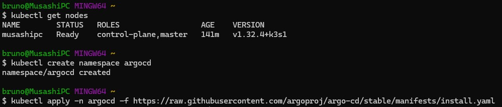

# Projeto CI/CD com GitHub Actions e ArgoCD (Monorepo)
## Objetivo do Projeto

### Automatizar o ciclo completo de desenvolvimento, build, deploy e execução de uma aplicação FastAPI simples, utilizando uma abordagem de monorepo. As tecnologias chave incluem GitHub Actions para CI/CD , Docker Hub como registry , e ArgoCD para entrega contínua em Kubernetes.

---

## Pré-requisitos e Setup do Ambiente

* **Conta no Docker Hub e Token de Acesso** : O Docker Hub atua como nosso Container Registry, armazenando as imagens Docker da aplicação.  O token de acesso é crucial para permitir que o GitHub Actions autentique e envie as imagens de forma segura. 
       
     Acesse https://hub.docker.com/ e crie uma conta ou faça login.

    Para criar o token:

     * Clique no seu nome de usuário no canto superior direito e vá para Account Settings.

     * No menu à esquerda, clique em Security.

     * Clique no botão New Access Token.

     * Clique em Generate.

* **Git** : Sistema de controle de versão usado para gerenciar todo o código-fonte e histórico do projeto. 
    ```bash
        git --version
    ```    
* **Python 3 e Docker** : Ferramentas fundamentais para desenvolver a aplicação FastAPI e para construir e executar os contêineres da aplicação, respectivamente.
    ```bash
        python3 --version
    ```   
* **Rancher Desktop com Kubernetes** : Fornece um ambiente Kubernetes local, permitindo simular um ambiente de produção para deploy e testes. Adiquirir em https://rancherdesktop.io/ .
* **`kubectl`** : A ferramenta de linha de comando padrão para interagir com o cluster Kubernetes, usada para verificar o status dos deploys e outros recursos.
* **ArgoCD** : A ferramenta de GitOps que sincroniza o estado do cluster com os manifestos declarados no repositório, automatizando a entrega contínua.

    ```Bash
        # 1. Cria um "namespace" (uma área isolada) para o ArgoCD
        kubectl create namespace argocd

        # 2. Instala o ArgoCD nesse namespace
        kubectl apply -n argocd -f https://raw.githubusercontent.com/argoproj/argo-cd/stable/manifests/install.yaml
    ```

    