# Projeto CI/CD com GitHub Actions e ArgoCD (Monorepo)
## Objetivo do Projeto

### Automatizar o ciclo completo de desenvolvimento, build, deploy e execução de uma aplicação FastAPI simples, utilizando uma abordagem de monorepo. As tecnologias chave incluem GitHub Actions para CI/CD , Docker Hub como registry , e ArgoCD para entrega contínua em Kubernetes.

---

## Pré-requisitos e Setup do Ambiente

* **Conta no Docker Hub e Token de Acesso** : O Docker Hub atua como nosso Container Registry, armazenando as imagens Docker da aplicação.  O token de acesso é crucial para permitir que o GitHub Actions autentique e envie as imagens de forma segura. 
       
     Acesse https://hub.docker.com/ e crie uma conta ou faça login.

    Para criar o token:

     * Clique no seu nome de usuário no canto superior direito e vá para Account Settings.

     * No menu à esquerda, clique em Security.

     * Clique no botão New Access Token.

     * Clique em Generate.

* **Git** : Sistema de controle de versão usado para gerenciar todo o código-fonte e histórico do projeto. 
    ```bash
        git --version
    ```    
* **Python 3 e Docker** : Ferramentas fundamentais para desenvolver a aplicação FastAPI e para construir e executar os contêineres da aplicação, respectivamente.
    ```bash
        python3 --version
    ```   
* **Rancher Desktop com Kubernetes** : Fornece um ambiente Kubernetes local, permitindo simular um ambiente de produção para deploy e testes. Adiquirir em https://rancherdesktop.io/ .
* **`kubectl`** : A ferramenta de linha de comando padrão para interagir com o cluster Kubernetes, usada para verificar o status dos deploys e outros recursos.
* **ArgoCD** : A ferramenta de GitOps que sincroniza o estado do cluster com os manifestos declarados no repositório, automatizando a entrega contínua.

    ```Bash
        # 1. Cria um "namespace" (uma área isolada) para o ArgoCD
        kubectl create namespace argocd

        # 2. Instala o ArgoCD nesse namespace
        kubectl apply -n argocd -f https://raw.githubusercontent.com/argoproj/argo-cd/stable/manifests/install.yaml
    ```

    


## Etapa 1: Estrutura do Projeto (Monorepo)

Este projeto utiliza uma abordagem de monorepo, onde todos os artefatos (código da aplicação e manifestos de deploy) residem em um único repositório Git. A estrutura é a seguinte:

*  Pasta **/app** : Contém todo o código-fonte da aplicação FastAPI, o `Dockerfile` para a containerização e as dependências Python.

```py
# main.py

from fastapi import FastAPI 

app = FastAPI() 

@app.get("/") 
async def root(): 
    return {"message": "Hello World"} 
```

```Dockerfile
# Dockerfile

FROM python:3.9-slim

WORKDIR /app

COPY requirements.txt .
RUN pip install --no-cache-dir -r requirements.txt

COPY . .

EXPOSE 80

CMD ["uvicorn", "main:app", "--host", "0.0.0.0", "--port", "80"]
```
* Pasta **/manifests** : Conterá os manifestos do Kubernetes (`deployment.yaml`, `service.yaml`) que definem como a aplicação deve ser executada no cluster. Esta pasta é a "fonte da verdade" para o ArgoCD.

## Etapa 2: Automação com GitHub Actions (CI)

Foi configurado um workflow de Integração Contínua (`CI`) em `.github/workflows/ci-cd.yml`. Este processo é acionado automaticamente a cada `push` de alterações na pasta `/app` da branch `main`.

```YAML
name: CI/CD - Build and Push Docker Image & Update Manifest

on:
  push:
    branches:
      - main
    paths:
      - 'app/**'

permissions:
  contents: write

jobs:
  build-push-and-update:
    runs-on: ubuntu-latest
    steps:
      - name: Checkout repository
        uses: actions/checkout@v4
        with:
          fetch-depth: 0

      - name: Set up Docker Buildx
        uses: docker/setup-buildx-action@v3

      - name: Login to Docker Hub
        uses: docker/login-action@v3
        with:
          username: ${{ secrets.DOCKER_USERNAME }}
          password: ${{ secrets.DOCKER_PASSWORD }}

      - name: Generate image tag
        id: generate_tag
        run: echo "tag=$(echo ${GITHUB_SHA} | cut -c1-7)" >> $GITHUB_OUTPUT

      - name: Build and push
        uses: docker/build-push-action@v5
        with:
          context: ./app
          push: true
          tags: ${{ secrets.DOCKER_USERNAME }}/${{ github.event.repository.name }}:${{ steps.generate_tag.outputs.tag }}

      - name: Update Kubernetes manifest
        run: |
          sed -i 's|image:.*|image: ${{ secrets.DOCKER_USERNAME }}/${{ github.event.repository.name }}:${{ steps.generate_tag.outputs.tag }}|' manifests/deployment.yaml

      - name: Commit and push manifest changes
        run: |
          git config --global user.name "github-actions[bot]"
          git config --global user.email "github-actions[bot]@users.noreply.github.com"
          git add manifests/deployment.yaml
          git commit -m "ci: update image tag to ${{ steps.generate_tag.outputs.tag }}"
          git pull --rebase
          git push
```

O workflow realiza as seguintes tarefas:
1.  Constrói uma imagem Docker da aplicação.
2.  Envia a imagem para o Docker Hub com uma tag única baseada no hash do commit.
3.  Atualiza o arquivo de manifesto (`manifests/deployment.yaml`) com a nova tag da imagem.
4.  Faz o commit e push da atualização do manifesto de volta para o repositório.

Para que o workflow se autentique no Docker Hub, os seguintes `secrets` foram configurados no repositório:
* `DOCKER_USERNAME`
* `DOCKER_PASSWORD`

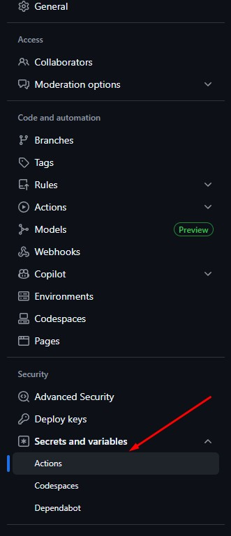 

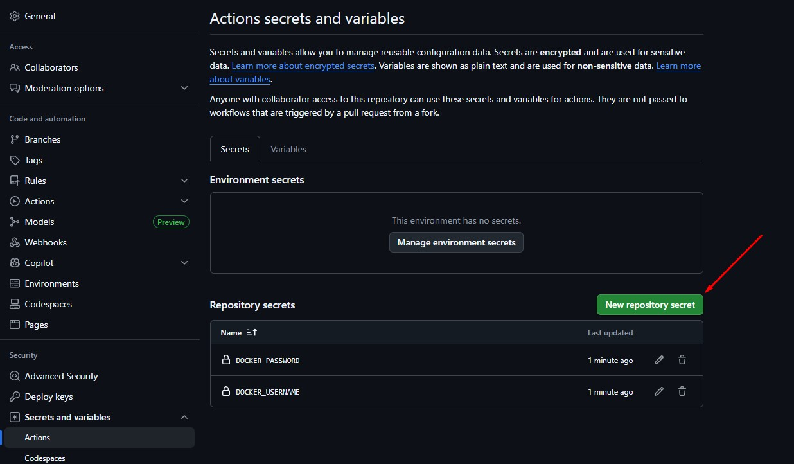

## Etapa 3: Manifestos do Kubernetes e Integração com a Pipeline

Nesta etapa, os manifestos do Kubernetes foram criados na pasta `/manifests` para definir como a aplicação será implantada no cluster. 

* **`deployment.yaml`** : Define o `Deployment` da aplicação. Ele gerencia a criação dos `Pods` e garante que um número específico de réplicas da aplicação esteja sempre em execução. Sua especificação de imagem é agora atualizada dinamicamente pela nossa pipeline de CI. 

```YAML
name: CI/CD - Build and Push Docker Image & Update Manifest

on:
  push:
    branches:
      - main
    paths:
      - 'app/**'

permissions:
  contents: write

jobs:
  build-push-and-update:
    runs-on: ubuntu-latest
    steps:
      - name: Checkout repository
        uses: actions/checkout@v4
        with:
          fetch-depth: 0

      - name: Set up Docker Buildx
        uses: docker/setup-buildx-action@v3

      - name: Login to Docker Hub
        uses: docker/login-action@v3
        with:
          username: ${{ secrets.DOCKER_USERNAME }}
          password: ${{ secrets.DOCKER_PASSWORD }}

      - name: Generate image tag
        id: generate_tag
        run: echo "tag=$(echo ${GITHUB_SHA} | cut -c1-7)" >> $GITHUB_OUTPUT

      - name: Build and push
        uses: docker/build-push-action@v5
        with:
          context: ./app
          push: true
          tags: ${{ secrets.DOCKER_USERNAME }}/${{ github.event.repository.name }}:${{ steps.generate_tag.outputs.tag }}

      - name: Update Kubernetes manifest
        run: |
          sed -i 's|image:.*|image: ${{ secrets.DOCKER_USERNAME }}/${{ github.event.repository.name }}:${{ steps.generate_tag.outputs.tag }}|' manifests/deployment.yaml

      - name: Commit and push manifest changes
        run: |
          git config --global user.name "github-actions[bot]"
          git config --global user.email "github-actions[bot]@users.noreply.github.com"
          git add manifests/deployment.yaml
          git commit -m "ci: update image tag to ${{ steps.generate_tag.outputs.tag }}"
          git pull --rebase
          git push
```

* **`service.yaml`** : Define um `Service` que expõe os `Pods` da aplicação a uma rede interna no cluster, permitindo a comunicação entre eles.

```YAML
apiVersion: v1
kind: Service
metadata:
  name: hello-app-service
spec:
  selector:
    app: hello-app
  ports:
    - protocol: TCP
      port: 8080 
      targetPort: 80 
```

### Com a criação desses arquivos, o ciclo de Integração Contínua (CI) está completo. Cada `push` na pasta `/app` agora dispara uma pipeline que constrói uma nova imagem, a publica no Docker Hub e atualiza automaticamente o arquivo `deployment.yaml` com a nova tag da imagem

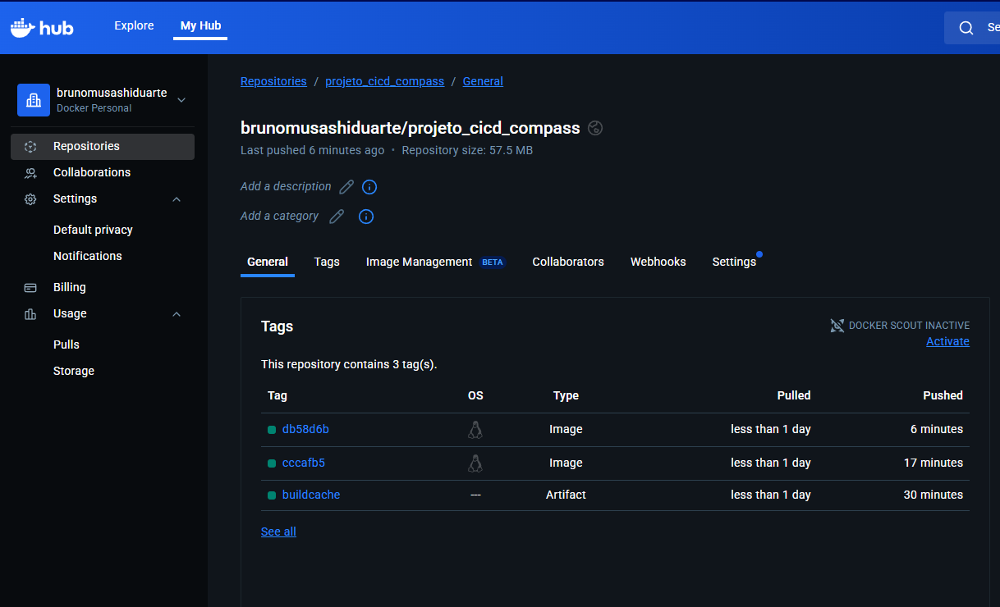

## Etapa 4: Entrega Contínua com ArgoCD

### A aplicação foi configurada no ArgoCD para automatizar a entrega contínua (Continuous Delivery). O ArgoCD foi conectado ao repositório Git e instruído a monitorar o caminho `/manifests` para sincronizar os deploys.

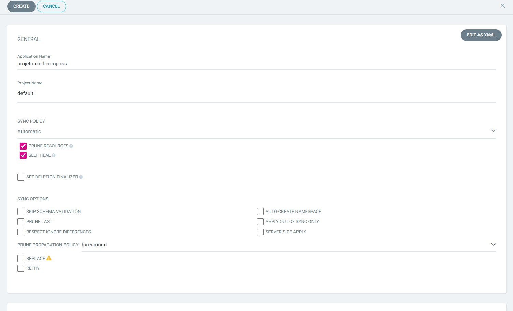

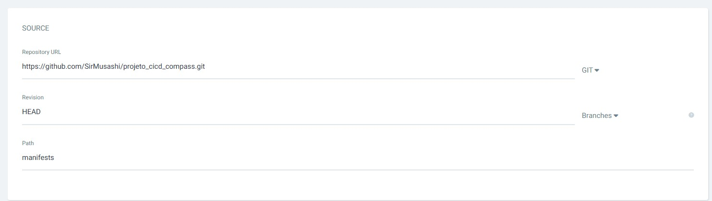

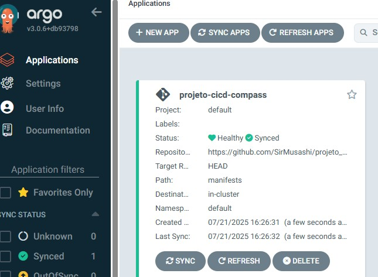

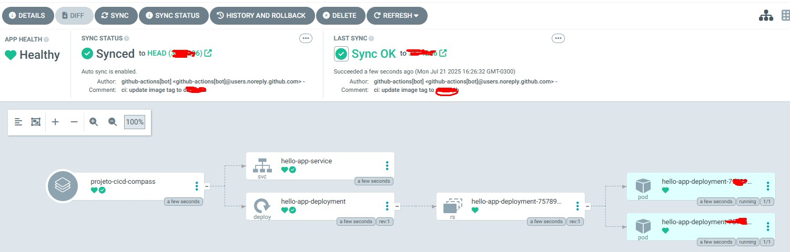

### Com a política de sincronização automática (`Automatic Sync`), qualquer alteração nos manifestos do Kubernetes que for enviada para a branch `main` será detectada e aplicada automaticamente ao cluster, garantindo que o estado da aplicação em execução seja sempre o mesmo que está declarado no Git.

## Etapa 5: Validação e Teste E2E (End-to-End)

### A aplicação implantada no cluster Kubernetes foi validada com sucesso.

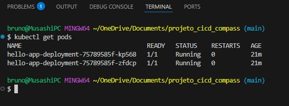

1.  **Acesso à Aplicação**: Utilizando `kubectl port-forward`, a aplicação foi exposta na porta local `8081` e pôde ser acessada através do navegador, respondendo como esperado.
```Bash
kubectl port-forward svc/hello-app-service 8081:8080
```

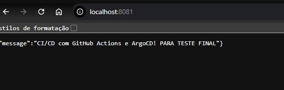


2.  **Teste do Ciclo Completo**: Uma alteração final no código-fonte da aplicação (`app/main.py`) foi enviada ao repositório. Isso disparou todo o fluxo automatizado:

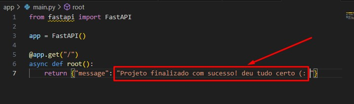

 * O GitHub Actions construiu e publicou a nova imagem.
* O manifesto de `Deployment` foi atualizado no Git pelo próprio workflow.
* O ArgoCD detectou a alteração e sincronizou o cluster, atualizando os `Pods` para a nova versão da aplicação.
* A alteração foi refletida com sucesso ao acessar novamente a aplicação no navegador.

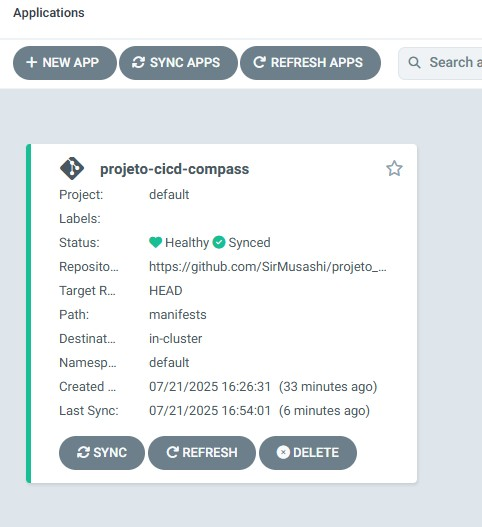

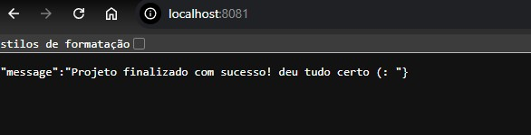

## Isso conclui a implementação de uma pipeline CI/CD completa com uma abordagem GitOps. (: